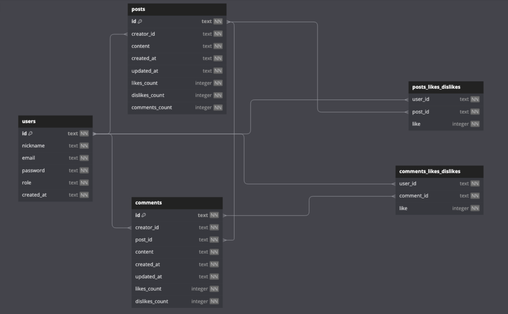

# Projeto LabEddit - Backend

## Documentação da API
XXX

## Link do back-end deployado
XXX

## Link do front-end deployado
XXX

## Contas e senhas já criadas
Utilize os usuários abaixo caso não queira criar uma nova conta:
  
leonardev@email.com
 
leonardev123
  
persefone@email.com
 
persefone123
  
anna@email.com
 
anna123
  
astrodev@email.com
 
astrodev99

## Instalação e Inicialização 
1. Criar as tabelas no arquivo **labedditback.db** que está na raiz do projeto
2. Ter o **node.js** instalado e rodar o comando **npm install**
3. Criar e configurar o **.env** baseado no **.env.example**
4. Para rodar o servidor localmente digite o comando **npm run dev**
5. Completadas as etapas anteriores, você poderá iniciar o front-end

## Descrição do projeto

O LabEddit Backend é uma API de rede social criada com o objetivo de promover a conexão e interação entre pessoas. Após realizar o cadastro e fazer o login na plataforma, os usuários da rede poderão criar e gerenciar postagens e comentários, bem como poderão dar like ou dislike nas publicações dos demais usuários.

## Tecnologias e conteúdos abordados
- NodeJS
- Typescript
- Express
- SQL e SQLite
- Knex
- POO
- Arquitetura em camadas
- Erros customizados
- Design Patterns e DTO - Zod (schema validator)
- Geração de UUID
- Geração de hashes
- Autenticação e autorização
- Roteamento
- Postman

## Recursos da API

- **Cadastro de Usuários**: Para poder interagir na rede social LabEddit, o usuário pode criar sua conta fornecendo informações pessoais básicas como **apelido/nome**, **email** e **senha**.

- **Criação e Gerenciamento de Postagens e Comentários**: Após realizarem o cadastro e o login na plataforma, os membros do LabEddit já podem fazer suas postagens e comentários, compartilhando suas ideias e momentos. Os membros possuem controle total sobre suas postagens e comentários, podendo editá-los ou excluí-los a qualquer momento.

- **Likes e Dislikes**: Os usuários podem dar **like** ou **deslike** nas postagens e comentários de outros membros, possibilitando uma melhor mensuração da qualidade (positiva ou negativa) do conteúdo compartilhado.

- **Recursos de Segurança**: Visando garantir a segurança e a privacidade dos usuários, o LabEddit pussui medidas de segurança como, senhas criptografadas, e também autenticação por meio de tokens JWT.

## Banco de dados

## Lista de requisitos do projeto

- Endpoints seguindo as boas práticas HTTP
    - [ ]  signup
    - [ ]  login
    - [ ]  create post
    - [ ]  get posts
    - [ ]  get post by id
    - [ ]  edit post
    - [ ]  delete post
    - [ ]  like / dislike post
    - [ ]  create comment
    - [ ]  get comments
    - [ ]  edit comment
    - [ ]  delete comment
    - [ ]  like / dislike comment

- Autenticação e autorização
    - [ ]  identificação UUID
    - [ ]  senhas hasheadas com Bcrypt
    - [ ]  tokens JWT
 
 - Código
    - [ ]  POO
    - [ ]  Arquitetura em camadas
    - [ ]  Roteadores no Express

- Uso do ExpressJS, Typescript e SQLite

- Cobertura de testes (pelo menos 70% da Business)

- API deployada

- Documentação README e POSTMAN 

## Desenvolvedor

Este projeto foi desenvolvido por:

**Leonardo Canone** : [LinkedIn](https://www.linkedin.com/in/leonardocanone/) | [GitHub](https://github.com/leonardocanone)